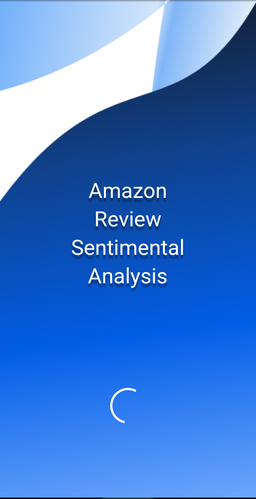
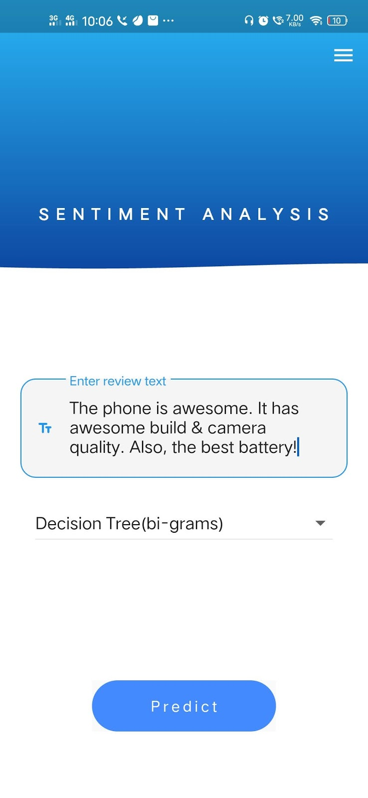
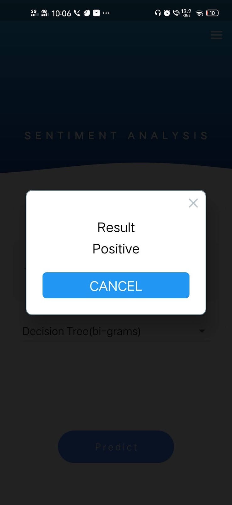

# ARSA
Amazon review sentiment analysis

## Motivation
Got the idea from the so much data available on customers reviews 

## Acknowledgements
Dataset used :https://nijianmo.github.io/amazon/index.html

## APP

<a href="https://github.com/Vishesh-Mittal/ARSA/blob/main/com.example.amazon_reveiw_sentiment_analysis.apk">Download</a>

## References

   The initial idea :https://docs.google.com/presentation/d/1gmZ4AAOpEYFAXzr05S9U2P8p5iUY9bWlogbYLqdlb-A/edit?usp=sharing

   The final report:https://docs.google.com/document/d/1R2zi-gCJMrOgw0iczRTWFF3JFOCN2LMyg9h-VbCYUKQ/edit?usp=sharing

